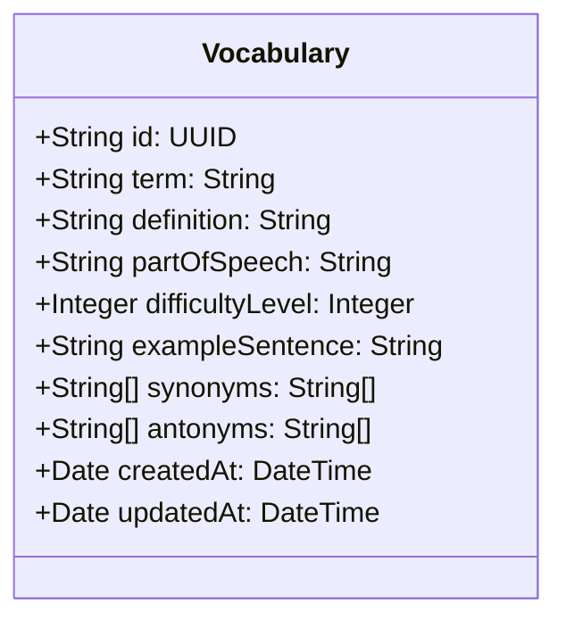
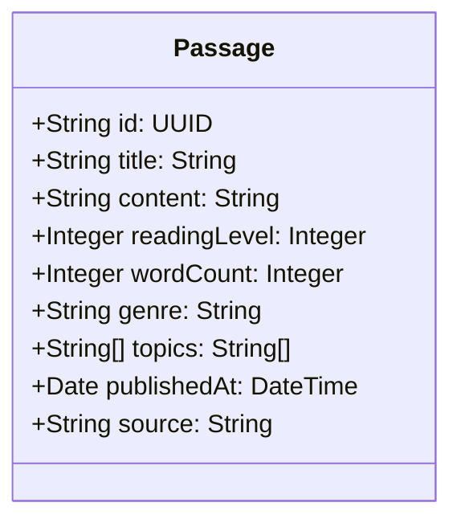
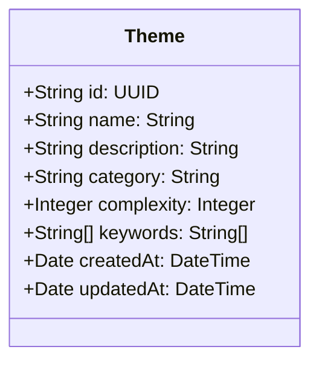
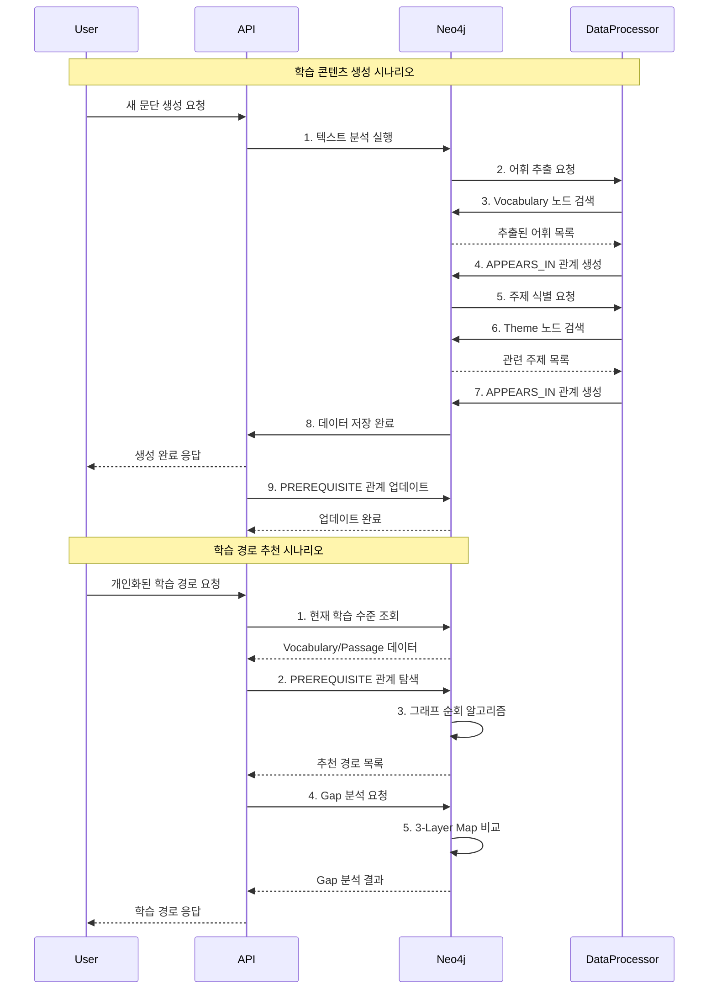
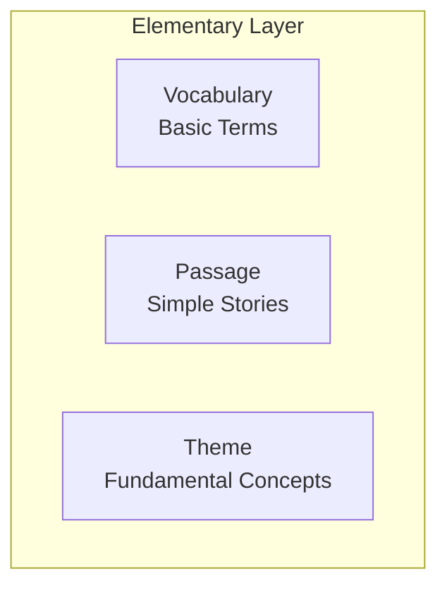
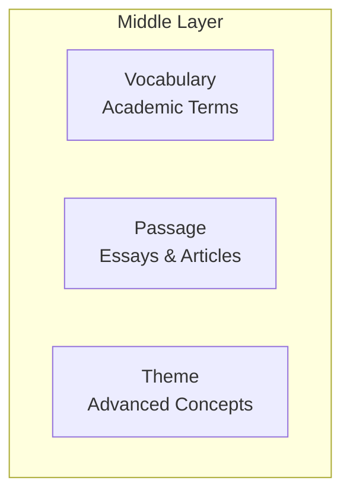
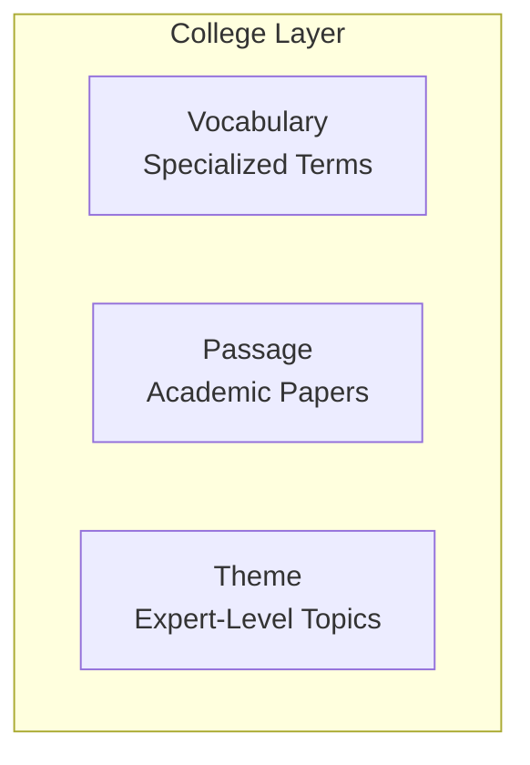
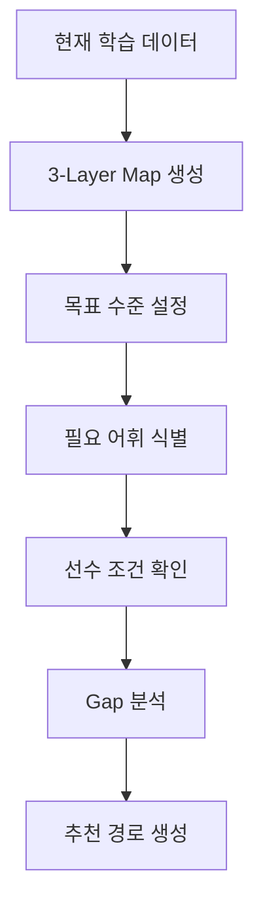
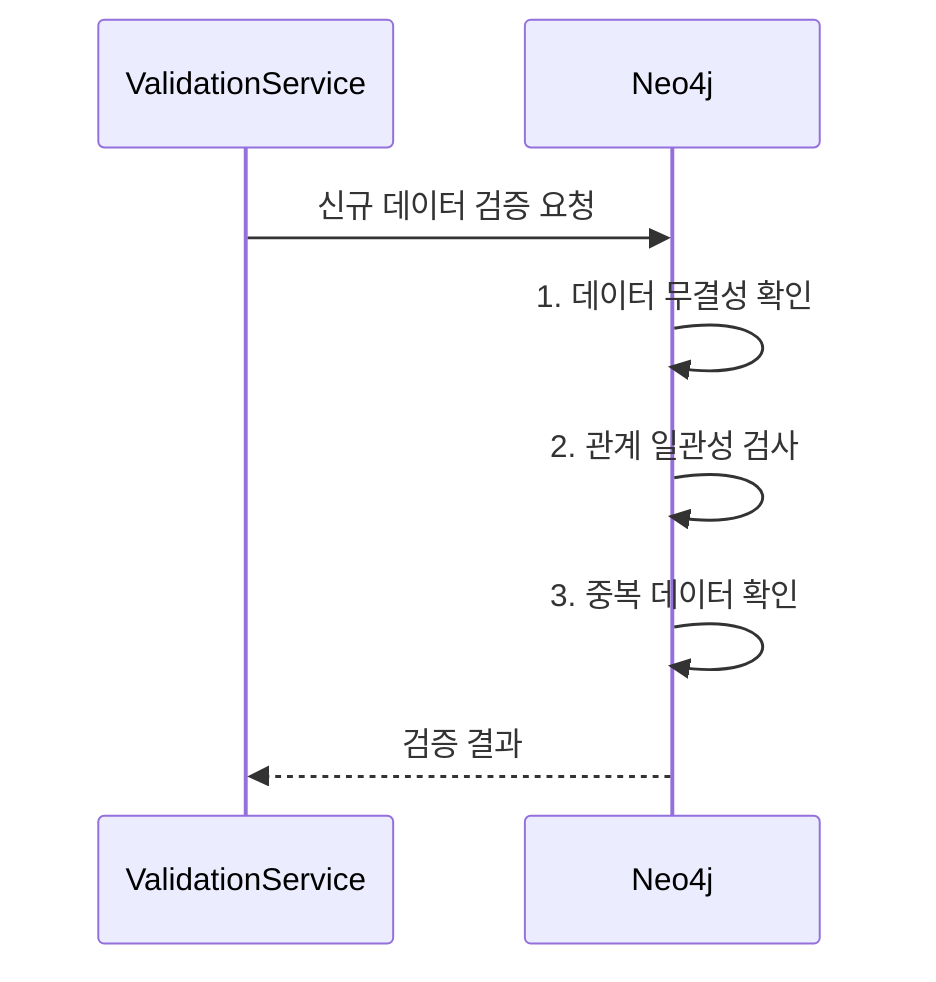
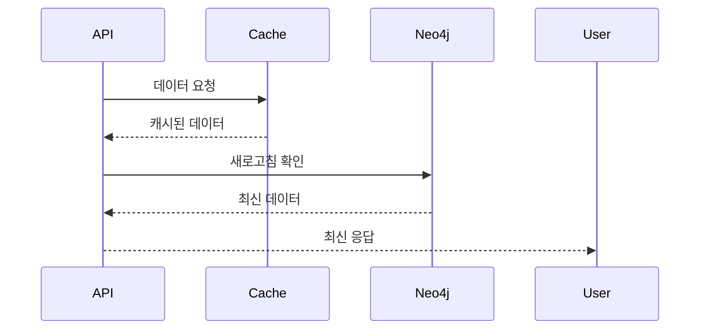

# EduOntology Sequence Diagram

## 개요
EduOntology 플랫폼의 데이터 모델링을 위한 시퀀스 다이어그램입니다. Neo4j 그래프 데이터베이스의 핵심 노드와 관계 구조를 정의합니다.

## 노드 (Nodes)

### 1. Vocabulary (어휘 노드)


**속성 설명**:
- `id`: 고유 식별자 (UUID)
- `term`: 어휘 항목
- `definition`: 정의
- `partOfSpeech`: 품사
- `difficultyLevel`: 난이도 등급 (1-10)
- `exampleSentence`: 예시 문장
- `synonyms/antonyms`: 동의어/반의어
- `createdAt/updatedAt`: 생성/수정 시간

### 2. Passage (문단 노드)


**속성 설명**:
- `id`: 고유 식별자 (UUID)
- `title`: 제목
- `content`: 내용
- `readingLevel`: 독해 수준 등급
- `wordCount`: 단어 수
- `genre`: 장르
- `topics`: 주제 목록
- `publishedAt`: 발행일
- `source`: 출처

### 3. Theme (주제 노드)


**속성 설명**:
- `id`: 고유 식별자 (UUID)
- `name`: 주제명
- `description`: 설명
- `category`: 카테고리
- `complexity`: 복잡도 등급
- `keywords`: 키워드 목록
- `createdAt/updatedAt`: 생성/수정 시간

## 관계 (Relationships)

### 1. APPEARS_IN (등장 관계)
```mermaid
classDiagram
    Vocabulary --> APPEARS_IN --> Passage
    Theme --> APPEARS_IN --> Passage

    class APPEARS_IN {
        +String id: UUID
        +Integer frequency: Integer
        +Integer position: Integer
        +Date discoveredAt: DateTime
    }
```

**관계 설명**:
- `Vocabulary → Passage`: 특정 어휘가 문단에 등장
- `Theme → Passage`: 특정 주제가 문단에 포함
- `frequency`: 등장 빈도
- `position`: 첫 등장 위치
- `discoveredAt`: 발견 시간

### 2. PREREQUISITE (선수 관계)
```mermaid
classDiagram
    Vocabulary - PREREQUISITE -> Vocabulary
    Vocabulary - PREREQUISITE -> Theme
    Theme - PREREQUISITE -> Theme

    class PREREQUISITE {
        +String id: UUID
        +String relationshipType: String
        +Integer confidence: Integer
        +Boolean mandatory: Boolean
        +Date validatedAt: DateTime
    }
```

**관계 설명**:
- `Vocabulary → Vocabulary`: 선수 어휘 관계 (예: '기초' → '고급')
- `Vocabulary → Theme`: 어휘-주제 선수 관계
- `Theme → Theme`: 주제 간 계층적 관계
- `relationshipType`: 관계 유형 (PRECEDES, REQUIRES, ENHANCES)
- `confidence`: 신뢰도 (0-100)
- `mandatory`: 필수 여부
- `validatedAt`: 검증 시간

## 완전한 시퀀스 다이어그램



## 3-Layer 구조

### 1. 초등 (Elementary) Layer


**특징**:
- 난이도: 1-3
- 어휘: 일상생활 기초 용어
- 독해 수준: 초등학생 수준
- 주제: 기본 개념

### 2. 중등 (Middle) Layer


**특징**:
- 난이도: 4-7
- 어휘: 학술 용어
- 독해 수준: 중학생 수준
- 주제: 복잡한 개념

### 3. 수능 (College) Layer


**특징**:
- 난이도: 8-10
- 어휘: 전문 용어
- 독해 수준: 고등/대학 수준
- 주제: 전문 수준 주제

## Gap 식별 알고리즘 개요



## 데이터 일관성 검증

### 1. 인그레스(Ingess) 검증


### 2. 이그레스(Egress) 검증


## 성능 최적화 전략

### 1. 인덱싱 전략
```
CREATE INDEX vocab_term_idx FOR (v:Vocabulary) ON (v.term)
CREATE INDEX theme_name_idx FOR (t:Theme) ON (t.name)
CREATE INDEX passage_title_idx FOR (p:Passage) ON (p.title)
```

### 2. 쿼리 최적화
```cypher
// 선수 관계 검색 쿼리
MATCH (target)-[:PREREQUISITE]->(prerequisite)
WHERE target.id = $targetId
RETURN prerequisite
ORDER BY prerequisite.difficultyLevel ASC
```

### 3. 배치 처리
```cypher
// 대량 데이터 처리
LOAD CSV WITH HEADERS FROM 'file:///vocabularies.csv' AS row
MERGE (v:Vocabulary {id: row.id})
SET v.term = row.term,
    v.definition = row.definition,
    v.partOfSpeech = row.partOfSpeech
```

## 다이어그램 상태

- **작성 완료**: ✓
- **검증 필요**: Neo4j 쿼리 실제 테스트
- **업데이트 필요**: 구현 후 성능 데이터 반영

## 다음 단계

1. Editor: Next.js 14 + Neo4j 연동 모듈 개발 (Task #3)
2. Browser: D3.js 시각화 테스트 시나리오 수립 (Task #4)
3. Protocol: EDU_ONTOLOGY_PROTOCOL.md 작성 (Task #5)