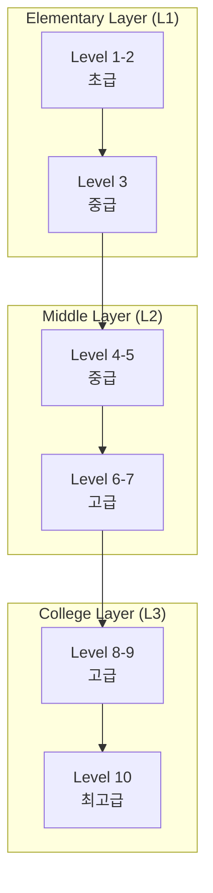

# 3-Layer Map Gap Identification Algorithm

## 개요

이 문서는 EduOntology 플랫폼의 3-Layer Map (초등→중등→수능)에서 학습 격차(Gap)를 식별하고 분석하는 알고리즘의 수학적 기반과 구현 세부 사항을 설명합니다.

## 알고리즘 개념

### 1. 3-Layer 구조 정의



### 2. Gap 식별 목표

1. **현재 수준**과 **목표 수준** 간의 격차 식별
2. **선수 조건**이 충족되지 않은 요소 찾기
3. **학습 경로** 생성 및 최적화
4. **개인화된** 학습 추천 제공

## 수학적 모델링

### 1. 노드 수학적 표현

각 학습 요소(Vocabulary, Theme, Passage)는 다음과 같은 속성을 가집니다:

```typescript
interface LearningNode {
  id: string
  type: 'vocabulary' | 'theme' | 'passage'
  difficulty: number  // 1-10 범위
  prerequisites: string[]  // 선수 조건 ID 목록
  dependencies: string[]  // 의존 관계 ID 목록
  layer: L1 | L2 | L3  // 속한 계층
  masteryLevel: number  // 마스터리 수준 (0-1)
  timeEstimate: number  // 학습 시간 (분)
}
```

### 2. Gap 계산 수식

#### 2.1 기본 Gap 점수

```typescript
function calculateGapScore(
  currentNode: LearningNode,
  targetNode: LearningNode,
  userProgress: Map<string, number>
): number {
  // 난이도 차이 계산
  const difficultyGap = Math.abs(targetNode.difficulty - currentNode.difficulty)

  // 선수 조건 충도 계산
  const prerequisiteGap = calculatePrerequisiteGap(
    targetNode.prerequisites,
    userProgress
  )

  // 레이어 간격 가중치
  const layerGapWeight = calculateLayerGapWeight(currentNode.layer, targetNode.layer)

  // 종합 Gap 점수
  const gapScore = (
    difficultyGap * 0.4 +
    prerequisiteGap * 0.4 +
    layerGapWeight * 0.2
  ) / 3

  return Math.min(100, gapScore)
}
```

#### 2.2 선수 조건 Gap 계산

```typescript
function calculatePrerequisiteGap(
  prerequisites: string[],
  userProgress: Map<string, number>
): number {
  if (prerequisites.length === 0) return 0

  let totalGap = 0
  let satisfiedCount = 0

  for (const prereqId of prerequisites) {
    const userMastery = userProgress.get(prereqId) || 0
    const masteryThreshold = 0.8  // 80% 마스터리 요구

    if (userMastery >= masteryThreshold) {
      satisfiedCount++
    } else {
      totalGap += (1 - userMastery) * 100
    }
  }

  // 만족도 비율 계산
  const satisfactionRate = satisfiedCount / prerequisites.length

  // Gap 점수는 0-100 사이의 값
  return (1 - satisfactionRate) * 100
}
```

#### 2.3 레이어 간격 가중치

```typescript
function calculateLayerGapWeight(fromLayer: Layer, toLayer: Layer): number {
  const layerWeights = {
    L1: { L1: 0, L2: 30, L3: 60 },
    L2: { L1: 30, L2: 0, L3: 30 },
    L3: { L1: 60, L2: 30, L3: 0 }
  }

  return layerWeights[fromLayer][toLayer]
}
```

### 3. 경로 탐색 알고리즘

#### 3.1 다익스트라 기반 학습 경로 찾기

```typescript
interface PathNode {
  node: LearningNode
  distance: number
  previous: PathNode | null
  gScore: number  // 시작 노드까지의 비용
  hScore: number  // 목표 노드까지의 추정 비용
}

function findOptimalLearningPath(
  startNodeId: string,
  targetNodeId: string,
  allNodes: LearningNode[],
  userProgress: Map<string, number>
): PathNode[] {

  const openSet = new Set<PathNode>()
  const closedSet = new Set<string>()
  const cameFrom = new Map<string, PathNode>()

  // 시작 노드 초기화
  const startNode = allNodes.find(n => n.id === startNodeId)
  if (!startNode) throw new Error('Start node not found')

  const startPathNode: PathNode = {
    node: startNode,
    distance: 0,
    previous: null,
    gScore: 0,
    hScore: heuristic(startNode, targetNodeId)
  }

  openSet.add(startPathNode)

  while (openSet.size > 0) {
    // fScore가 가장 낮은 노드 선택
    const current = findLowestFScore(openSet)

    if (current.node.id === targetNodeId) {
      return reconstructPath(cameFrom, current)
    }

    openSet.delete(current)
    closedSet.add(current.node.id)

    // 인접 노드 탐색
    const neighbors = findNeighbors(current.node, allNodes)

    for (const neighbor of neighbors) {
      if (closedSet.has(neighbor.id)) continue

      // 실제 비용 계산
      const tentativeGScore = current.gScore + calculateTransitionCost(
        current.node,
        neighbor,
        userProgress
      )

      const existingPath = Array.from(openSet).find(p => p.node.id === neighbor.id)

      if (!existingPath || tentativeGScore < existingPath.gScore) {
        cameFrom.set(neighbor.id, current)

        const newPathNode: PathNode = {
          node: neighbor,
          distance: tentativeGScore,
          previous: current,
          gScore: tentativeGScore,
          hScore: heuristic(neighbor, targetNodeId)
        }

        if (!existingPath) {
          openSet.add(newPathNode)
        }
      }
    }
  }

  throw new Error('No path found')
}
```

#### 3.2 휴리스틱 함수

```typescript
function heuristic(
  fromNode: LearningNode,
  toNodeId: string,
  allNodes: LearningNode[]
): number {
  const toNode = allNodes.find(n => n.id === toNodeId)
  if (!toNode) return 0

  // 난이도 차이를 휴리스틱으로 사용
  return Math.abs(toNode.difficulty - fromNode.difficulty)
}

function calculateTransitionCost(
  fromNode: LearningNode,
  toNode: LearningNode,
  userProgress: Map<string, number>
): number {
  let cost = 0

  // 난이도 차이
  cost += Math.abs(toNode.difficulty - fromNode.difficulty) * 10

  // 레이어 이동 비용
  if (fromNode.layer !== toNode.layer) {
    cost += calculateLayerGapWeight(fromNode.layer, toNode.layer)
  }

  // 선수 조건 충족도
  const userMastery = userProgress.get(fromNode.id) || 0
  cost += (1 - userMastery) * 20

  return cost
}
```

## Gap 분석 시나리오

### 시나리오 1: 기초 학습에서 고급 학습으로

```typescript
// 사용자 현재 상태
const userProgress = new Map([
  ['vocab_basic', 0.9],  // 기초 어휘 마스터리
  ['vocab_intermediate', 0.6],  // 중간 어휘 마스터리
])

// 타겟 노드
const targetNode = {
  id: 'college_concept',
  difficulty: 9,
  layer: L3,
  prerequisites: ['intermediate_concept', 'advanced_concept']
}

// Gap 계산
const gapScore = calculateGapScore(
  findCurrentNode(userProgress),
  targetNode,
  userProgress
)

// 결과: 75점 (높은 Gap)
```

### 시나리오 2: 점진적 학습 경로

```typescript
// 최적 학습 경로 생성
const optimalPath = findOptimalLearningPath(
  'vocab_basic',
  'college_concept',
  allLearningNodes,
  userProgress
)

// 경로 출력
console.log(optimalPath.map(p => ({
  node: p.node.term,
  difficulty: p.node.difficulty,
  estimatedTime: p.node.timeEstimate
})))
```

## 구현 계획

### 1. 알고리즘 모듈화

```typescript
// gap-algorithm/index.ts
export class GapAnalyzer {
  private nodes: LearningNode[]
  private userProgress: Map<string, number>

  constructor(nodes: LearningNode[], userProgress: Map<string, number>) {
    this.nodes = nodes
    this.userProgress = userProgress
  }

  // Gap 분석
  analyzeGap(targetNodeId: string): GapAnalysisResult {
    // ...
  }

  // 최적 경로 찾기
  findOptimalPath(startNodeId: string, targetNodeId: string): PathResult {
    // ...
  }

  // 추천 생성
  generateRecommendations(targetNodeId: string): Recommendation[] {
    // ...
  }
}

export interface GapAnalysisResult {
  targetNode: LearningNode
  gapScore: number
  missingPrerequisites: LearningNode[]
  recommendedPath: LearningNode[]
  estimatedTime: number
}
```

### 2. 성능 최적화

1. **미리 계산된 Gap 캐싱**
2. **계층별 분할 처리**
3. **비동계적 병렬 처리**
4. **그래프 인덱싱**

### 3. 실시간 업데이트

```typescript
// 실시간 Gap 업데이트
export class GapManager {
  private gapCache = new Map<string, number>()

  updateProgress(nodeId: string, masteryLevel: number) {
    // 사용자 진도 업데이트 시 관련 Gap 재계산
    this.updateRelatedGaps(nodeId)
  }

  private updateRelatedGaps(changedNodeId: string) {
    // 관련 노드들의 Gap 업데이트
    // ...
  }
}
```

## 검증 및 테스트

### 1. 단위 테스트

```typescript
describe('GapAnalysis', () => {
  test('should calculate gap score correctly', () => {
    const analyzer = new GapAnalyzer(testNodes, testProgress)
    const result = analyzer.analyzeGap('target1')

    expect(result.gapScore).toBeGreaterThan(0)
    expect(result.missingPrerequisites.length).toBeGreaterThan(0)
  })
})
```

### 2. 통합 테스트

```typescript
describe('LearningPath', () => {
  test('should find optimal path', () => {
    const path = findOptimalLearningPath(
      'start1',
      'end1',
      testNodes,
      testProgress
    )

    expect(path.length).toBeGreaterThan(0)
    expect(isValidPath(path)).toBe(true)
  })
})
```

### 3. 성능 테스트

```typescript
describe('Performance', () => {
  test('should handle large graphs efficiently', () => {
    const largeGraph = generateLargeGraph(1000)
    const start = performance.now()

    const result = findOptimalLearningPath(
      'start',
      'end',
      largeGraph,
      new Map()
    )

    const duration = performance.now() - start
    expect(duration).toBeLessThan(1000) // 1초 이내
  })
})
```

## 모니터링 및 개선

### 1. 메트릭 수집

```typescript
interface GapMetrics {
  totalGapScore: number
  averageGapScore: number
  gapDistribution: {
    low: number
    medium: number
    high: number
  }
  mostCommonGaps: Array<{
    nodeId: string
    gapCount: number
  }>
}
```

### 2. 지속적인 개선

1. **사용자 피드백 반영**
2. **학습 패턴 분석**
3. **알고리즘 파라미터 최적화**
4. **새로운 Gap 유형 추가**

이 알고리즘은 EduOntology 플랫폼의 학습 경로 추천 시스템의 핵심적인 역할을 하며, 개인화된 교육 경험을 제공하는 데 필수적인 요소입니다.